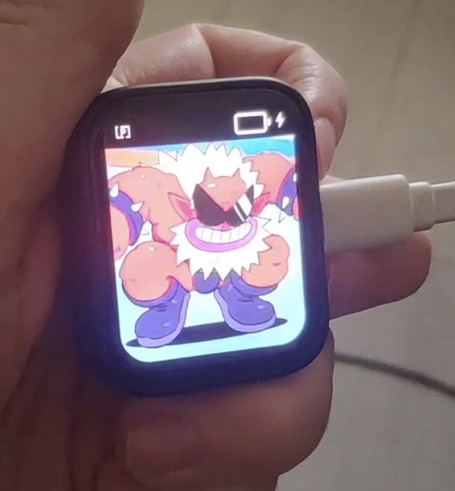

# Animated LCD Badge

ESP32-S3 firmware for a wearable LCD badge that plays GIF/PNG media from an SD card on a [**Waveshare ESP32-S3 Touch AMOLED 1.8"**](https://www.waveshare.com/wiki/ESP32-S3-Touch-AMOLED-1.8) display.

The project is built with PlatformIO + Arduino framework and uses BitBank display/decoder libraries for efficient rendering.



See [demo video](assets/cropped-demo.mp4).

## Features

- Plays media from SD card (`.gif` and `.png`)
- 15-20 FPS GIF playback (depending on content)
- Multiple playback modes:
	- **Manual**: loop current item until you click to skip
	- **Auto**: play GIFs sequentially (PNG files are skipped)
	- **Playlist**: play files listed in `playlist.txt`, with optional per-item delay
- Single-button control (BOOT button / GPIO0):
	- short press → next file
	- long press (~1s) → switch playback mode
- On-screen status bar overlay with:
	- battery percentage
	- charging indicator
	- current playback mode icon
- Battery/PMU integration for AXP2101 (charge and battery telemetry)

## Hardware Target

- Board: Waveshare ESP32-S3 Touch AMOLED 1.8"
- MCU: ESP32-S3 (PSRAM required)
- Storage: microSD card over SD_MMC
- PMU: AXP2101 (battery/charging status)

## Requirements

- [PlatformIO](https://platformio.org/) (VS Code extension or CLI)
- ESP32 toolchain (installed by PlatformIO)
- microSD card with media files

## Build & Flash

```bash
pio run -e waveshare-esp32-s3-touch-amoled-18
pio run -e waveshare-esp32-s3-touch-amoled-18 -t upload
pio device monitor -b 115200
```

## SD Card Content

Put media files at the SD card root, for example:

```text
/01lu.gif
/02lu.gif
/p03.png
/p04.png
```

Supported extensions are case-insensitive: `.gif`, `.png`.

## Playlist Mode

If `playlist.txt` exists in SD root, long-pressing mode button cycles into **Playlist** mode.

File format (one entry per line):

```text
/file.gif
/file.png 5
```

- First token: file path (from SD root)
- Optional second token: delay in seconds before automatic interrupt/advance

Example (`playlist.txt`):

```text
/02lu.gif
/01lu.gif
/p03.png 5
/p04.png 5
/04lu.gif
```

## Notes
- It is strongly recommended to compress and resize GIFs to overcome limitations of AnimatedGIF library and for better performance (e.g. using [ezgif.com](https://ezgif.com/optimize)).
  - **Optimize -> Lossy Gif** (Compression: 200) and **Optimize -> Coalesce** (unoptimize)
- Review battery charging current settings in `battery_status.cpp` for your specific battery to ensure proper charging behavior.
  - By default it is set to 500mA
- If SD card init fails, the display shows an error prompt until media is available.
- If no supported files are found, playback stops with an error message.
